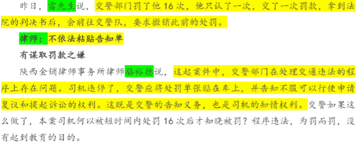
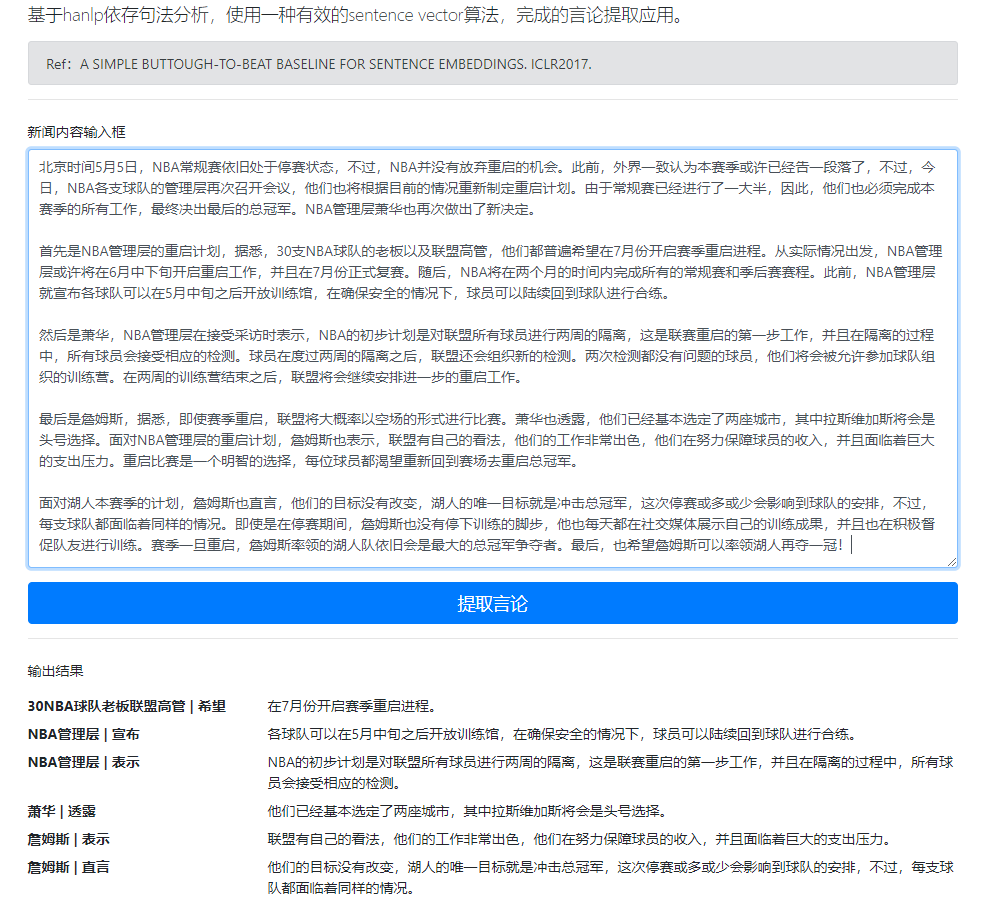
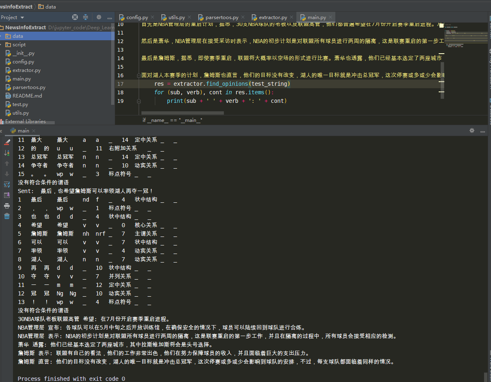

### 项目背景

随着每天涌入的新闻信息越来越多，获得不同人物对于不同事件的观点，获得重要人物每日对于不同事项的观点描述，这个功能对于新闻阅读、观点总结能够起到很大的辅助作用。

如果有一款新闻阅读的app， 把文中的每个人的核心观点整理出来，总结成表格，那么对于读者来说，就容易看清楚多了。

舆情分析，危机预测， 知识图谱等等各种任务， 我们往往需要采集很多任务的观点，尤其是事实描 述的时政、社会新闻，其主要信息往往其实在不同人物的言论中。

例如：

### 任务描述

所以，我们面对的是这样一个任务：

- 输入：TEXT，一段新闻文字
- 输出：List， 文中每个人物/实体的观点

### 项目结构

#### 模型层

- 获得所有表示“说”的意思的单词

  > 使用维基百科 + 新闻语料库制作的词向量，BFS搜索，获得出所有与“说”意思接近的单词

- Dependency Parsing

  > 使用NER, Dependency Parsing 等方式，获得是谁说了话，说了什么话。使用pyhanlp分析结构。对比ltp，pyhanlp的NER识别效果相对更好一些。

- 确定言论的结束

  > Tfidf 的句子向量化：获得句子向量之后，可以把判断两句话是不是类似的、说得同一个主题（这两个句子的距离是不是小于某个阈值）。
  >
  > word2vec词向量句子的向量化：使用单词的词向量加权+ 减去PCA抽取主成分（公共的信息）。该方法效果优于Tfidf 的句子向量化。
  >
  > * 普林斯顿句子向量论文：https://openreview.net/pdf?id=SyK00v5xx

使用Flask展示简单网页。

